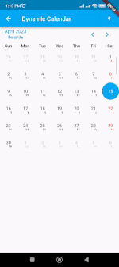
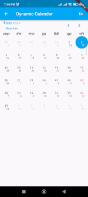
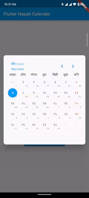

Calendar widget that can switch between Nepali Date [BS] and English Date [AD].

    


## Features

* Easy to use API
* Customizable widget as per the requirements
* Changable between BS and AD
* Dynamic events and holidays

### Installation

Add the following line to `pubspec.yaml`:

```yaml
dependencies:
  flutter_bs_ad_calendar: ^1.0.4
```

### Basic setup

*The full example is available [here](https://github.com/BwesShr/flutter_bs_ad_calendar/blob/master/example/lib/main.dart).*

```dart
import 'package:flutter_bs_ad_calendar/flutter_bs_ad_calendar.dart';

    CalendarType _calendarType = CalendarType.ad;


    FlutterBSADCalendar(
        calendarType: _calendarType,
        firstDate: DateTime(1970),
        lastDate: DateTime(2024),
        onMonthChanged: (date) => print('month changed: ${date.toString()}'),
        onDateSelected: (date) => print('selected day: ${date.toString()}'),
    );
```

## Additional information

Following additional features available

```dart
onDateSelected: (date) {
    print('month changed: ${date.toString()}');
},
onMonthChanged: (date) {
    print('month changed: ${date.toString()}');
},
todayDecoration: BoxDecoration(
    borderRadius: const BorderRadius.all(Radius.circular(10)),
    color: Theme.of(context).primaryColorLight,
    shape: BoxShape.rectangle,
),
selectedDayDecoration: BoxDecoration(
    borderRadius: const BorderRadius.all(Radius.circular(10)),
    color: Theme.of(context).primaryColorDark,
    shape: BoxShape.rectangle,
),
dayBuilder: (dayToBuild) {
    return Container(
        padding: const EdgeInsets.symmetric(
            horizontal: 8.0,
        ),
        child: Column(
            mainAxisAlignment: MainAxisAlignment.center,
            children: [
                Align(
                    alignment: Alignment.topCenter,
                    child: Text(
                        '${dayToBuild.day}',
                        style: Theme.of(context).textTheme.bodyMedium,
                    ),
                ),
            ],
        ),
    );
},
```

To update the visible calendar format dynamically add the line to the widget:

```dart
calendarType: _calendarType
```

Update the value [_calendarType] as per the requirement to change the calendar type.
